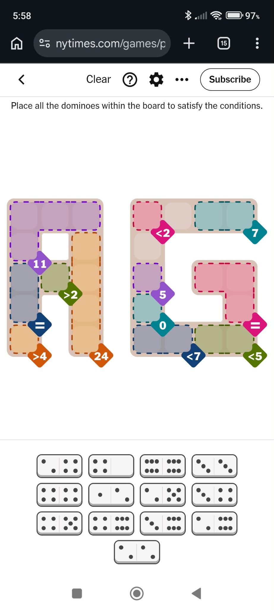

# Pips from Image

A modern, browser-based application to reconstruct and solve domino logic puzzles directly from screenshots, or create, save, and play custom puzzles.

---

## Getting Started

### Prerequisites
- Node.js (v18 or higher recommended)
- npm

### Installation & Local Development
```bash
# Install dependencies
npm install

# Start local development server
npm run dev
```

Open your browser and navigate to `http://localhost:5173`.

### Testing & Production Build
```bash
# Run unit and regression test suite
npm test

# Build for production
npm run build
```

---

## Operating the Application

### 1. Importing a Screenshot
On the main screen:
- **Drag and Drop**: Drag any puzzle screenshot image (PNG, JPEG, or WebP) directly into the upload area.
- **Browse**: Click the upload box to select an image from your device.
- **Paste (Ctrl+V / Cmd+V)**: Paste a copied screenshot from your clipboard anywhere on the screen.
- The app automatically detects the grid dimensions, playable cells, regions, constraints, and domino pieces directly in the browser with zero server uploads.

### 2. Verifying and Editing the Puzzle
After scanning, the Verification screen presents the **Original Screenshot** and the **Reconstructed Puzzle** side-by-side:
- **Direct Play**: Click **Start Puzzle** to begin playing immediately.
- **Edit Button**: Click **Edit** in the top header to slide open the correction pane:
  - **Regions & Constraints**: Add, edit, recolor, or delete regions. Change constraint rules (Sum, Less Than, Greater Than, Equal, Different) and values.
  - **Cell Assignment**: Select a region and click cells on the board to add or remove them. Use **Toggle Cells/Holes** to mark cells as playable or void holes.
  - **Domino Inventory**: Adjust domino pip values (0 to 6), swap halves, or add/delete dominoes.
- Click **Close Editor** when finished, then click **Start Puzzle**.

### 3. Playing the Game
- **Timer**: The live timer starts automatically as soon as the board appears.
- **Rotating Dominoes**: Click any domino in the tray to rotate it 90 degrees clockwise (cycles through Horizontal, Vertical, Reversed-Horizontal, Reversed-Vertical).
- **Placing Dominoes**: Drag any domino from the tray toward the board. Cells snap into place smoothly with generous proximity matching.
- **Moving & Removing**: Click or drag any placed domino on the board to move it to another spot or return it.
- **Instant Reset**: Click the **Reset** button in the header to immediately return all dominoes to the tray without clearing your elapsed time.
- **Resume Game**: Exiting back to the main menu saves your progress. Click **Resume Puzzle** anytime on the home screen to pick up right where you left off with the timer continuing.

### 4. Custom Puzzle Editor (Build Manually)
Click **Build Manually** on the home screen to access the full editor:
- **Grid Sizing**: Adjust row and column count using the `+` / `-` controls.
- **Playable Cells & Holes**: Right-click (or tap) any cell to toggle between a playable tile and a void hole.
- **Regions & Rules**: Create regions, choose colors, assign constraint rules, and select cells for each region.
- **Domino Inventory**: Add dominoes to match the board capacity (playable cells must equal $2 \times \text{domino count}$).
- **Saving Puzzles**: Click the **Save** button in the top bar to download your puzzle as a `.json` file.
- **Importing Puzzles**: Click the **Import** button to load any previously saved `.json` puzzle file.
- **Play Puzzle**: Click **Play Puzzle** to play your custom puzzle.

### Example Screenshot
Here is an example screenshot (`game1.jpg`) that can be dropped or uploaded into the application:

<p align="center">
  
</p>